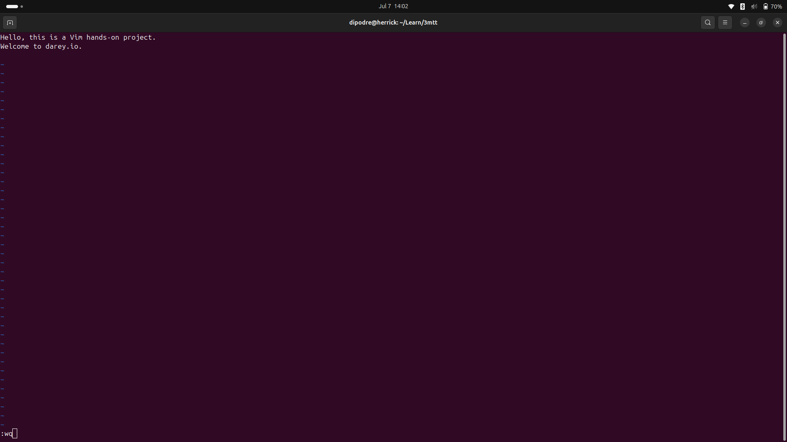
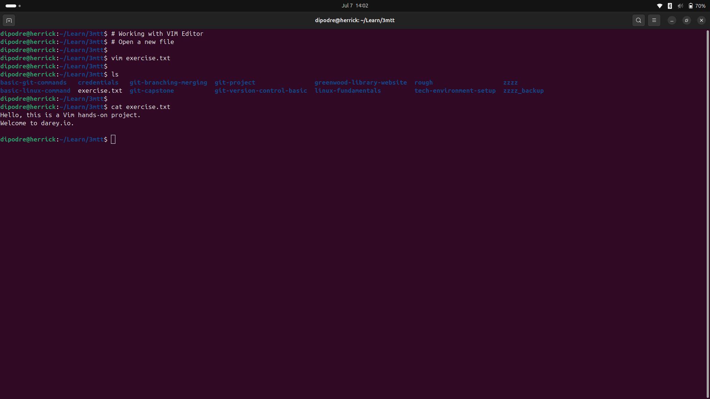
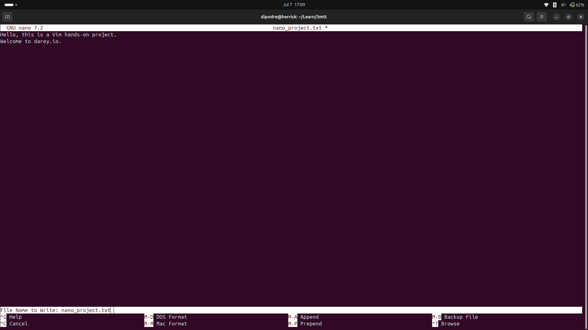
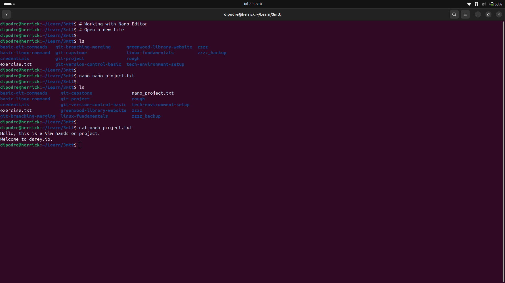

<!-- ABOUT THE PROJECT -->
## LINUX TEXT EDITOR

### Objective

For this project, the following steps were taken to demonstrate usage of popular linux text editors:

- [LINUX TEXT EDITOR](#linux-text-editor)
  - [Objective](#objective)
    - [Linux Text Editor](#linux-text-editor-1)
    - [VIM Text Editor](#vim-text-editor)
    - [NANO Text Editor](#nano-text-editor)

----

#### Linux Text Editor

It is a software application used for creating, modifying and managing text files on a linux sysytem.

File manipulation by text editor will be demonstrated using the VIM and Nano text editors.

----


#### VIM Text Editor

Using the vim editor, a file will be created by running the command below:
```vim exercise.txt```



Then, the editor mode is changed to insert mode by pressing the **i** key.
Once, editing is done, the editor mode is exited by pressing the **esc** key.
The file is saved and the editor exited by entering **:wq** and pressing **Enter**.




----

#### NANO Text Editor

Using the nano editor, a file will be created by running the command below:
```nano nano_project.txt```



Then, add a random text to the file.
Once, editing is done, press the **Ctrl** + **O** keys and press **Enter** to save.
Afterwards, exit the editor by pressing the **Ctrl** + **X** keys.




